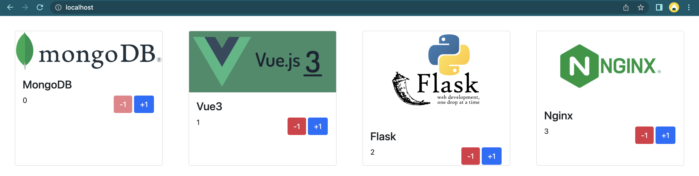

# Demo-Flask-Vue3-Mongo-Docker

## Running

```sh
docker-compose build --force-rm && docker-compose up
```

- --force-rm flag is optional as it is just used to prevent creation of dangling containers

## Usage

- Frontend: http://localhost
- Mongo-Express UI: http://localhost:8081
- API Documentation: http://localhost/backend

## Docker Compose Setup

### Services

1. frontend (container name: vue-frontend)
    - Hosted Production Build through nginx server
2. backend (container name: flask-backend)
    - Hosted Production Build through gunicorn+gevent server
3. db (container name: mongo-db)
4. mongo-express (container name: mongo-express)
5. reverse-proxy (container name: reverse-proxy)
    - Implemented using nginx server

### Network

1. fvm-network

## Screenshots

### Frontend



### API Documentation

[Full API Documentation](./backend/README.md)


### MongoDB


